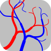

<h1>  &nbsp; Vascular.Networks </h1>

#### Procedural Plumbing for Bioengineers
This package contains the core libraries for defining vascular trees, their bounding geometries and functional structures, and the operations to build, optimize, constrain, analyze and triangulate them.
Libraries for import/export of common file formats are also provided.

This is a heavy, memory hungry package designed to solve a very limited subset of the general vasculature design problem very quickly, focussed entirely on practical tissue engineering.
It does not deal with the microenvironment or functional unit design, focussing instead on tiling vessels into the mesoscale (the limit of where we actually have control over in tissue engineering).
You need to do the microscale design work and run simulations or tests yourself before passing it to the methods contained here, or just guess / copy whatever real tissue looks like (it works more often than you'd expect).
Similarly, it does not make adjustments for viscosity correction factors that are required at small radii, because successful tissue engineering requires the cells to remodel and actively control the vessel radii at this scale.
If you need to do design work below this length scale, you'll probably want to work in subregions to generate microvasculature.

This package is currently in pre-release so APIs should not be considered stable: if you build on top of this, fix your version number!
Development is directly onto the `develop` branch, there are no guarantees that this will even build at a point in time.
Releases to NuGet will occur on a vibes-based schedule.
During Version 0.X, the minor version number will indicate breaking changes.

#### Collaboration/Support
This is not a complete piece of software; rather, a set of libraries that may be used to build one.
If you are an experimentalist and want custom networks or bespoke software for your use case without needing to write code, get in touch.

#### License
This project is licensed under the [GNU Affero General Public License v3.0 (AGPL-3.0)](LICENSE).

#### Contributing
This project does not currently accept contributions.

## The roadmap to 1.0
- Support for variable viscosity (e.g. Fåhræus-Lindqvist effect) and some degree of variable pressure at the network outlets (e.g. two-stage networks for functional structures and surrounding capillary bed), if possible to do without a generic constrained minimization package.
  - A separate package for optimization and setting radii in the most general case.
- Support for higher order splitting:
  - ~~Adapt splitting function and optimizer to work with n-furcations.~~
  - Adapt topological actions.
  - Fix any holes in collision/~~export~~ that don't actually work with arbitrary degree splits.
  - Merging/splitting heuristics.
- Structure:
  - Multiple source networks, mobile source nodes.
  - Remove conditional compilation terms, or make network/branch/node generic so that data can be attached without requiring additional maps.
  - Splitting:
    - Amplifying downstream radii (and reducing upstream) to ensure minimum feature sizes.
    - Fixed vessels (where radii fractions are always known).
- Optimization:
  - Replace old costs with new ones.
  - Simplify interface to optimizer.
    - Integrate "soft-toplogy" and gradient descent (+ predicated movement) to ensure valid state.
    - Remove actions queue, provide interface to rebalance+trim/regroup+split
- Collision:
  - Intercept and ignore API for imaging/predefined roots context.
- Hybrid of LSV/ACCO growth - a general purpose growth method.
- ~~Move Vascular.Analysis and CAD interop into a separate repository, merge with rendering libraries.~~
- Output:
  - Slice streaming as image/curve.
  - Support for basic mesh options such as cutting out of a boundary.
- Input:
  - Support for approximating a mesh with point sources - deriving this set of sources to be in a separate repository.
  - Converting a generic graph to a network. (Loading graphs and peripheral information to be done separately).
- Housekeeping:
  - Documentation and API consistency.
  - Tidy up legacy bits.
  - ~~Enable nullable.~~
  - ~~Remove data contract members.~~

## Installation
`dotnet add package Vascular.Networks`

#### Requirements
.NET 6.0

## Build
The project copies its output to a [NuGet convention-based working directory](https://docs.microsoft.com/en-us/nuget/create-packages/creating-a-package#from-a-convention-based-working-directory) /Release/ in release configuration: `dotnet build -c Release`.
All additional content files are copied to this structure.
In Debug, output files are copied to a flat folder structure /Debug/TFM/ for the given Target Framework Moniker.

To clean the release folder, copy over package assets and build the package, use the build file with the 'pack' target: `dotnet msbuild build.targets -t:pack`.
This sets the configuration to release and builds documentation.

#### Conditional compilation
For types in the `Vascular.Structure` namespace, a custom build can choose to improve performance by removing fields that are not needed:
- `NoEffectiveLength` - The most common use case for optimization is a combination of work and volume, so the branches by default keep track of their effective lengths and propagate these changes upstream, allowing instant query of the volume from the source node.
  Defining this disables the effective length caching.
- `NoDepthPathLength` - Path lengths and logical depths are calculated from the root downwards in a single pass and stored at each node. If defined, these fields and methods are removed.
  Note that some optimization predicates may require depths to be defined, although flow rate could be used as a proxy in this case.
- `NoPressure` - Pressures may be calculated downwards from the root after radii are assigned. If defined, these fields and methods are removed.
